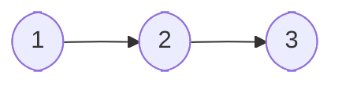
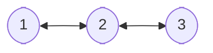

# Utils 

## Algorithms (TBD)
## Structures

### Arrays

#### array
#### stack
#### queue

### Graphs
#### linked lists
##### Single Linked List

##### Double Linked List

#### trees
#### basic graph

## Logger

## Time

## Math (TBD)

## Parsers
### JSON

## Sockets (TBD)

## Validator