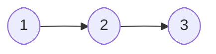
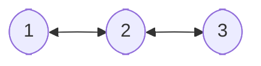

# Utils 

## Algorithms (TBD)

## Patterns
`NOTE: all info on patterns was taken from the book 'Design Patterns Elements of Reusable Object-Oriented Software by Erich Gamma, Richard Helm, Ralph Johnson, John M. Vlisside (1994)'`
## Structures

### Arrays

#### array
#### stack
#### queue

### Graphs
#### linked lists
##### Single Linked List

```mermaid
flowchart LR
    node1([1])-->node2([2])-->node3([3])
```
##### Double Linked List

```mermaid
flowchart LR
    node1([1])<-->node2([2])<-->node3([3])
```
#### trees
#### basic graph

## Logger

## Time

## Math (TBD)

## Parsers
### JSON

## Sockets

POSIX TCP sockets under `prb17::utils::sockets`:

- `socket` — RAII wrapper around a TCP file descriptor (send/recv bytes and
  newline-framed strings).
- `socket_connecter` — connects to a listening peer.
- `socket_listener` — binds a port (0 = OS-assigned) and accepts connections on
  its own thread, invoking a handler per connection.
- `endpoint` — an `address:port` pair with `to_string`/`from_string`.
- `message` — a structured, line-framed message (`source|destination|type|body`).

### Roadmap (systems topics, TBD)

Higher-level facilities to build on the socket core: a message-passing `Comm`
(Sender/Receiver over a blocking queue), then client/server patterns, caching,
proxies, load balancers, replication/sharding, leader election, pub/sub,
rate limiting, and security/HTTPS.

## Validator
