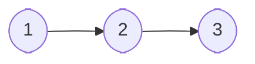
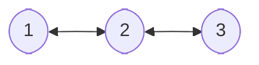

# Utils 

## Algorithms (TBD)

## Patterns
`NOTE: all info on patterns was taken from the book 'Design Patterns Elements of Reusable Object-Oriented Software by Erich Gamma, Richard Helm, Ralph Johnson, John M. Vlisside (1994)'`
## Structures

### Arrays

#### array
#### stack
#### queue

### Graphs
#### linked lists
##### Single Linked List

##### Double Linked List

#### trees
#### basic graph

## Logger

## Time

## Math (TBD)

## Parsers
### JSON

## Sockets (TBD)

## Validator