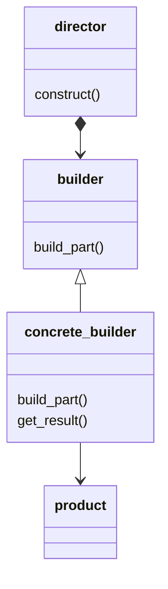
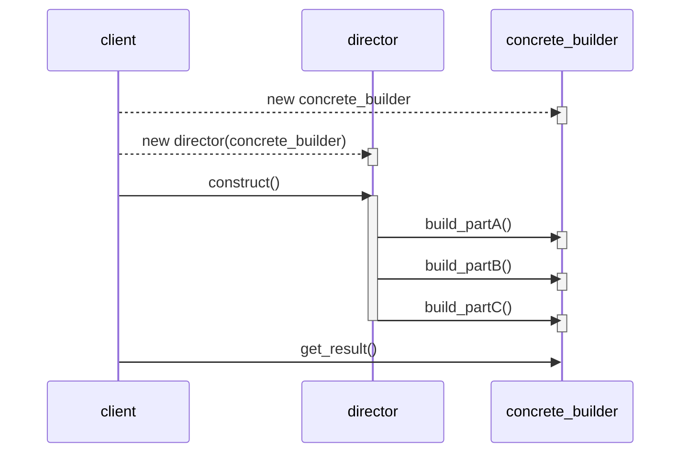

# Builder Pattern

## Intent
The builder pattern is meant to separate the construction of a complex object from its representation so that the same construction process can create different representations

## Aplicability
Use the Builder pattern when:
- the algorithm for creating a complex object should be independent of the parts that make up the object and how they're assembled
- the construction process must allow different representations for the object that's constructed

## Structure

## Collaborations
